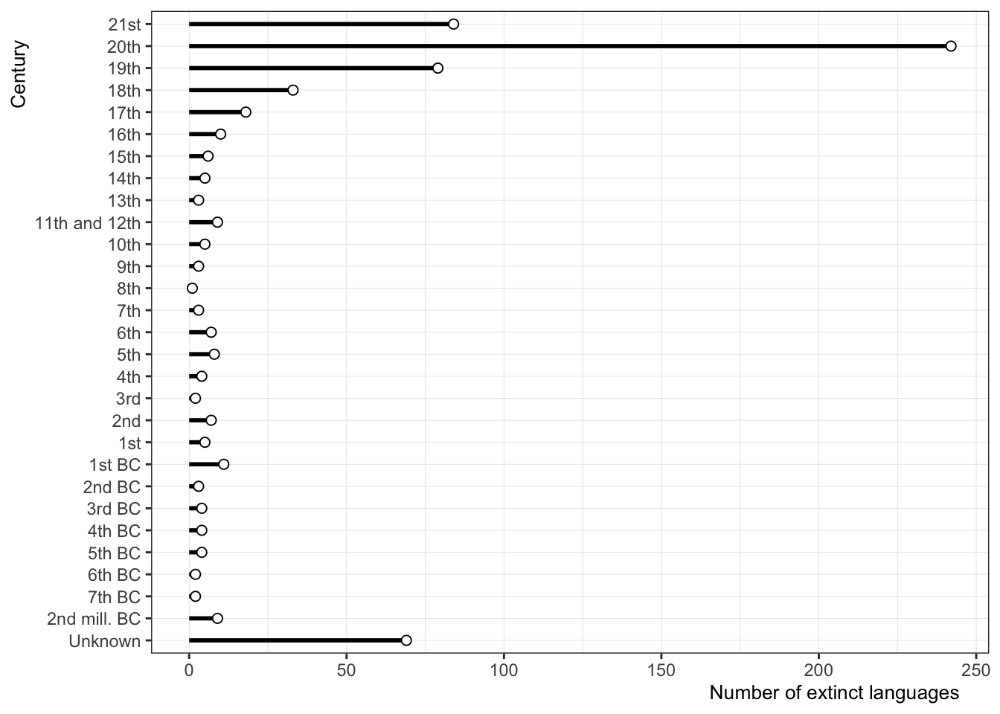
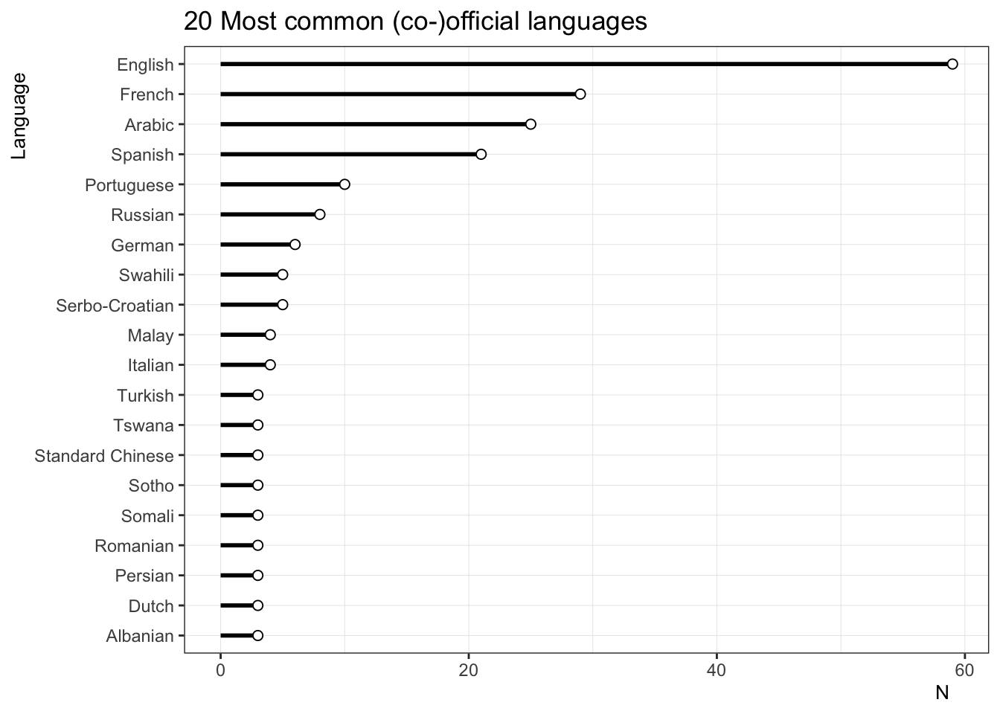
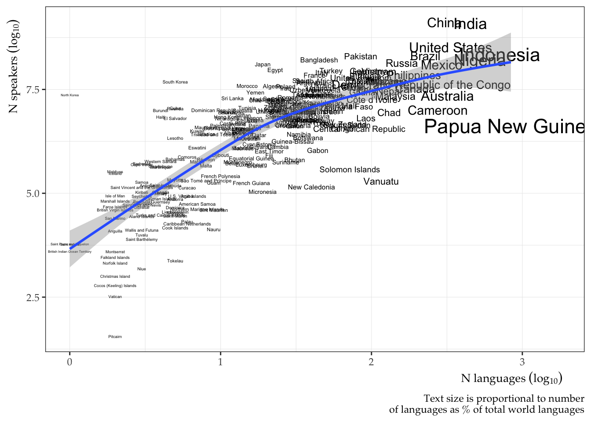

<!--
badges: start
  

badges: end 
-->

## worldlanguages 

An R Package of Data Sets About the World’s Languages.

Last update: 2022-12-13

### Overview

The worldlanguages package provides a series of data sets with
information about the languages of the world. All the data is freely
available and scrapped from the internet.

### Installation

You can install the development version from GitHub with:

    remotes::install_github("jvcasillas/worldlanguages")

### Datasets

- [extinct_languages](#extinct_languages)
- [language_names](#language_names)
- [languages_by_country](#languages_by_country)
- [n_countries_by_language](#n_countries_by_language)
- [n_languages_by_country](#n_languages_by_country)
- [n_words_by_language](#n_words_by_language)
- [native_speakers](#native_speakers)
- [total_speakers](#total_speakers)

#### `extinct_languages`

- A long-form data set scraped from wikipedia containing an information
  about 642 extinct languages.
- Information on the data, language family, region, and terminal
  speakers is provided if available.
- The table was curated by scraping multiple tables from:  
  <https://en.wikipedia.org/wiki/List_of_languages_by_time_of_extinction>

<!-- -->

    ## Rows: 642
    ## Columns: 7
    ## $ language         <chr> "Mednyj Aleut", "Yahgan", "Wukchumni dialect of Tule-…
    ## $ date             <chr> "5 October 2022", "16 February 2022", "25 September 2…
    ## $ century          <chr> "21st", "21st", "21st", "21st", "21st", "21st", "21st…
    ## $ language_family  <chr> "Mixed Aleut–Russian", "Isolated", "Yok-Utian (propos…
    ## $ region           <chr> "Commander Islands, Russia", "Magallanes, Chile", "Ca…
    ## $ terminal_speaker <chr> "Gennady Yakovlev[1]", "Cristina Calderón[2]", "Marie…
    ## $ notes            <chr> "", "", "", "", "", "", "", "", "", "", "", "", "", "…

#### `language_names`

- A long-form data set scraped from wikipedia containing an information
  about 599 languages.
- The data were scraped from:
  <https://en.wikipedia.org/wiki/List_of_language_names>

<!-- -->

    ## Rows: 599
    ## Columns: 4
    ## $ language_en <chr> "'Phags-pa", "Aari", "Aasáx", "Abaza", "Abellen", "Abenaki…
    ## $ language    <chr> "ꡖꡍꡂꡛ ꡌ", "Aari", "Aasá", "Aбаза бызшва", "Ayta Abellen", …
    ## $ notes       <chr> "Formerly Used in: the People's Republic of China , the Re…
    ## $ is_extinct  <lgl> TRUE, FALSE, TRUE, FALSE, FALSE, TRUE, FALSE, FALSE, FALSE…

#### `languages_by_country`

- A long-form data set scraped from wikipedia containing a list of the
  languages spoken in 212 different countries.
- The data set distinguishes between official, regional, minority, and
  national status, as well as widely spoken languages.
- The data were scraped from:
  <https://en.wikipedia.org/wiki/List_of_official_languages_by_country_and_territory>

<!-- -->

    ## Rows: 212
    ## Columns: 6
    ## $ country_region    <chr> "Abkhazia", "Afghanistan", "Albania", "Algeria", "An…
    ## $ official_language <chr> "Abkhaz, Russian", "Persian (Dari), Pashto", "Albani…
    ## $ regional_language <chr> "", "Uzbek, Turkmen, Pashayi, Nuristani, Balochi, Pa…
    ## $ minority_language <chr> "Georgian", "", "Greek, Macedonian, Aromanian", "", …
    ## $ national_language <chr> "Abkhaz", "Persian (Dari), Pashto", "", "Arabic, Tam…
    ## $ widely_spoken     <chr> "", "Persian (Dari)", "Italian", "French", "", "Ango…

#### `n_countries_by_language`

- A long-form data set scraped from wikipedia containing an approximate
  number of countries in which 36 of the world’s languages are
  recognized as being (co-)official.
- The data set also contains counts by continent and the country names.
- The table was scraped from:
  <https://en.wikipedia.org/wiki/List_of_languages_by_the_number_of_countries_in_which_they_are_recognized_as_an_official_language>

<!-- -->

    ## Rows: 36
    ## Columns: 8
    ## $ language  <chr> "English", "French", "Arabic", "Spanish", "Portuguese", "Ger…
    ## $ world     <dbl> 59, 29, 25, 21, 10, 6, 8, 5, 5, 4, 4, 3, 3, 3, 3, 3, 3, 3, 3…
    ## $ africa    <dbl> 23, 21, 13, 1, 6, 0, 0, 5, 0, 0, 0, 0, 0, 3, 3, 0, 0, 0, 0, …
    ## $ americas  <dbl> 14, 2, 0, 19, 1, 0, 0, 0, 0, 0, 0, 1, 0, 0, 0, 0, 0, 0, 0, 0…
    ## $ asia      <dbl> 5, 0, 12, 0, 2, 0, 3, 0, 0, 0, 4, 0, 3, 0, 0, 0, 3, 0, 0, 0,…
    ## $ europe    <dbl> 3, 5, 0, 1, 1, 6, 5, 0, 5, 4, 0, 2, 0, 0, 0, 3, 0, 3, 3, 0, …
    ## $ oceania   <dbl> 14, 1, 0, 0, 0, 0, 0, 0, 0, 0, 0, 0, 0, 0, 0, 0, 0, 0, 0, 0,…
    ## $ countries <chr> "United Kingdom, United States,[L 1]Canada, Australia, New Z…

#### `n_languages_by_country`

- A long-form data set scraped from wikipedia containing an approximate
  number of languages spoken in 242 countries.
- The data set also contains data on immigrant languages.
- The table was scraped from:
  <https://en.wikipedia.org/wiki/Number_of_languages_by_country>

<!-- -->

    ## Rows: 242
    ## Columns: 9
    ## $ rank            <dbl> 1, 2, 3, 4, 5, 6, 7, 8, 9, 10, 11, 12, 13, 14, 15, 16,…
    ## $ country         <chr> "Papua New Guinea", "Indonesia", "Nigeria", "India", "…
    ## $ nol_established <dbl> 840, 707, 526, 447, 302, 287, 274, 226, 219, 217, 212,…
    ## $ nol_immigrant   <dbl> 0, 3, 7, 6, 3, 5, 1, 93, 116, 11, 2, 8, 11, 1, 1, 0, 6…
    ## $ nol_total       <dbl> 840, 710, 524, 453, 305, 292, 275, 319, 335, 228, 214,…
    ## $ nol_percent     <dbl> 11.81, 9.98, 7.37, 6.37, 4.29, 4.11, 3.87, 4.49, 4.71,…
    ## $ nos_total       <dbl> 4213381, 222191197, 163317444, 1257421714, 1319419348,…
    ## $ nos_mean        <dbl> 5040, 315165, 348225, 2924237, 4472608, 435886, 38451,…
    ## $ nos_median      <dbl> 1315, 3500, 14000, 35000, 27700, 4730, 10000, 10, 12, …

    ## `geom_smooth()` using formula = 'y ~ s(x, bs = "cs")'

#### `n_words_by_language`

- A long-form data set scraped from wikipedia containing an approximate
  number of words contained in dictionaries from 126 languages.
- The table was scraped from:
  <https://en.wikipedia.org/wiki/List_of_dictionaries_by_number_of_words>

<!-- -->

    ## Rows: 126
    ## Columns: 5
    ## $ language      <chr> "Korean", "Portuguese", "Finnish", "Tamil", "Kurdish", "…
    ## $ n_headwords   <int> 1100373, 818000, 800000, 784553, 744139, 600000, 578707,…
    ## $ n_definitions <int> NA, NA, NA, NA, NA, NA, 1317179, NA, NA, NA, NA, NA, NA,…
    ## $ dictionary    <chr> "우리말샘 (Woori Mal Saem, 2017)", "Aulete Digital", "Re…
    ## $ notes         <chr> "Online open dictionary including dialects of South and …

#### `native_speakers`

- A long-form data set scraped from wikipedia containing an approximate
  number of native speakers for 27 of the world’s languages.
- The data set also contains information regarding the language family,
  language branch, and other notes.
- The table was scraped from:
  <https://en.wikipedia.org/wiki/List_of_languages_by_number_of_native_speakers>

<!-- -->

    ## Rows: 27
    ## Columns: 5
    ## $ language                 <chr> "Mandarin Chinese", "Spanish", "English", "Hi…
    ## $ native_speakers_millions <dbl> 920.0, 475.0, 373.0, 344.0, 234.0, 232.0, 154…
    ## $ language_family          <chr> "Sino-Tibetan", "Indo-European", "Indo-Europe…
    ## $ branch                   <chr> "Sinitic", "Romance", "Germanic", "Indo-Aryan…
    ## $ notes                    <chr> "incl. Standard Chinese, but excl. other vari…

#### `total_speakers`

- A long-form data set scraped from wikipedia containing the number of
  L1 and L2 speakers of 45 languages.
- The data set also contains information regarding the language family,
  language branch, and other notes.
- The table was scraped from:
  <https://en.wikipedia.org/wiki/List_of_languages_by_total_number_of_speakers>

<!-- -->

    ## Rows: 45
    ## Columns: 7
    ## $ language       <chr> "English", "Mandarin Chinese", "Hindi", "Spanish", "Fre…
    ## $ family         <chr> "Indo-European", "Sino-Tibetan", "Indo-European", "Indo…
    ## $ branch         <chr> "Germanic", "Sinitic", "Indo-Aryan", "Romance", "Romanc…
    ## $ notes          <chr> NA, "incl. Standard Chinese, but excl. other varieties"…
    ## $ l1_speakers    <dbl> 372900000, 929000000, 343900000, 474700000, 79900000, 0…
    ## $ l2_speakers    <dbl> 1.080e+09, 1.987e+08, 2.583e+08, 7.360e+07, 1.942e+08, …
    ## $ total_speakers <dbl> 1.452e+09, 1.118e+09, 6.022e+08, 5.483e+08, 2.741e+08, …
